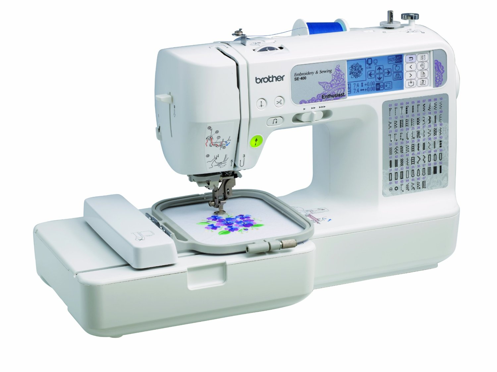

## Brother SE-400 Embroidery Machine

This file contains notes on how ot use the 
Brother SE-400 Embroidery Machine.

## Tools and Supplies

We have tools and supplies in the cabinet.

In terms of fabric, we have various cotton cloths.
In order to embroider, you will need to place stabilizer
behind the cloth.
We have cut-away and tear-away stabilizer.
We recommend you use cut-away.
The stabilizer is pre-cut into 8x8 in sheets.
To prepare fabric to be embroidered,
place the fabric and the stabilizer in the hoop,
and stretch tightly.

The machine has two threads: bobbin thread and embroidery thread.
Before embroiding, make sure the bobbin is preloaded with thread.
Consult the manual for how to wind the bobbin.
We have special bobbin thread, which is heavier weight than the
embroidery thread.

For embroidering, we have have 40 weight polyester thread in 
a variety of colors.

While embroidering, you may bend or break a needle.
We have a stash of extra needles.
Typically you would use a 75/11 needle.
If you need to replace a needle, following the instructions in the manual.

## Embroidering

Prepare a PES file using with the design you want to embroider.
We recommend you do this by writing a python program that
creates a stich pattern.

Next set up the machine for embroidery.

First, move the embroidery foot to the up position.

Second, pick a spool of thread and put it in the spool holder.
Thread the upper thread through mechanisms including the foot.
Cut it to the proper length.
Then use the auto-threader to thread the needle.
Consult the manual for pictures and details on how to do this.

Third, place your hoop with fabric and stabilizer into the embrodery sled,
and latch into position.

Next, transfer a pattern from your laptop to the embroidery machine.
Plug in the USB cable into your laptop
and turn on the machine.
The brother machine should mount itself as a usb flash drive.
On my Mac, it shows up as _NO_NAME_.
Copy the PES file into the volume.

Next select the USB icon on the touch screen.

Finally, lower the foot and push the start button.
The machine should begin to embroider!

## Manuals

[Brother SE-400](https://www.brother-usa.com/products/SE400)

[Quick Reference Guide](doc/885v31_v33_qg01_usenes.pdf)

[Users Manual](doc/885v31_v32_v33_om04en.pdf)

## Software

[pyembroidery](https://github.com/EmbroidePy/pyembroidery)

[inkstitch](https://inkstitch.org/)

## File formats

[PES/PEC](https://github.com/frno7/libpes/wiki/PES-format)

[PES](https://github.com/frno7/libpes/wiki/PES-section)

[PEC](https://github.com/frno7/libpes/wiki/PEC-section)

[More PEC](https://edutechwiki.unige.ch/en/Embroidery_format_PEC)

[DST]()

[File viewer](https://backface.github.io/html5-embroidery/)

