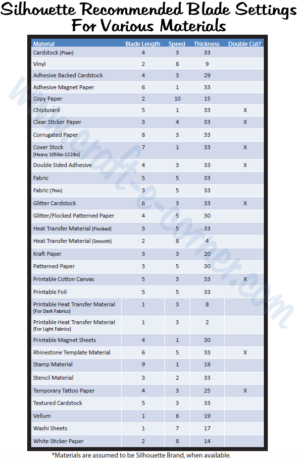
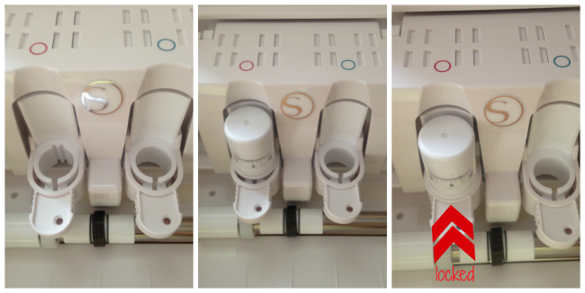

## Silhouette Cameo 3

This file contains notes on how to use the Silhouette Cameo 3 Craft Cutter.

### Getting Started with the Machine

In order to do anything with the Cameo, you first have to   
1. Load the material (with or without a cutting mat).
2. Adjust the blade depth.
3. Load the blade.

#### Loading the material

Below are helpful links for feeding your material to the machine in various ways.

1. [Load your material with a cutting mat.](https://www.youtube.com/watch?v=17fOYQWrdoo)
	* Since we are not using the Silhouette Studio software like they do in this video, set your material size by making your canvas in whatever program you're using to design equal to the width and height of the material in inches or mm.

2. [Load your material without a cutting mat.](https://silhouette-secrets.com/2018/04/28/cutting-without-a-mat-on-the-cameo-3/) 

3. [Adjust the roller bars.](https://www.youtube.com/watch?v=BaBgzUAT34M)

4. [Additional guide on the cutting mat and loading the material](http://blog.craft-e-corner.com/2016/11/the-silhouette-cameo-mat-all-you-need-to-know-and-more.html)

#### Setting the blade length.

The standard ratchet blade which you will be using has the ability to cut a variety of materials such as normal paper, cardstock, fabric and more. To accomodate each material, it has an adjustable blade length that goes between 1 to 10 with 10 being the longest blade length. As a general rule of thumb, the thicker your material, the longer your blade length should be. (Note that you will often see blade length also refered to as blade depth.)

1. **Choose the right depth of the blade.**

	Here is a helpful guide taken from [blog.craft.e-corner](http://blog.craft-e-corner.com/2016/08/silhouette-101-all-about-the-blades.html) on the appropriate blade settings for different types of materials. 

	

	* This image shoes the recommended speed and "thickness" as well. To minimize confusion, ignore these columns for now and we'll come back to them later when you cut. 

2. [**Adjust the blade length.**](https://www.youtube.com/watch?v=q0jupRU44d4)

3. **Installing the blade.**
	
	
	* Image taken from [Silhouette School Blog](https://www.silhouetteschoolblog.com/2016/07/silhouette-cameo-3-release-getting-started.html)

	The above image shows the blade holder. To install the blade, pull the white tab on the blade holder out, put the blade into the blade slot (remember to push down fully), and push the tab back in to lock.

	Similarly, to remove the blade, unlock first by pulling the tab out.

	Here is a [helpful video](https://www.youtube.com/watch?v=q0jupRU44d4) that goes into more detail for troubleshooting blade installation problems.