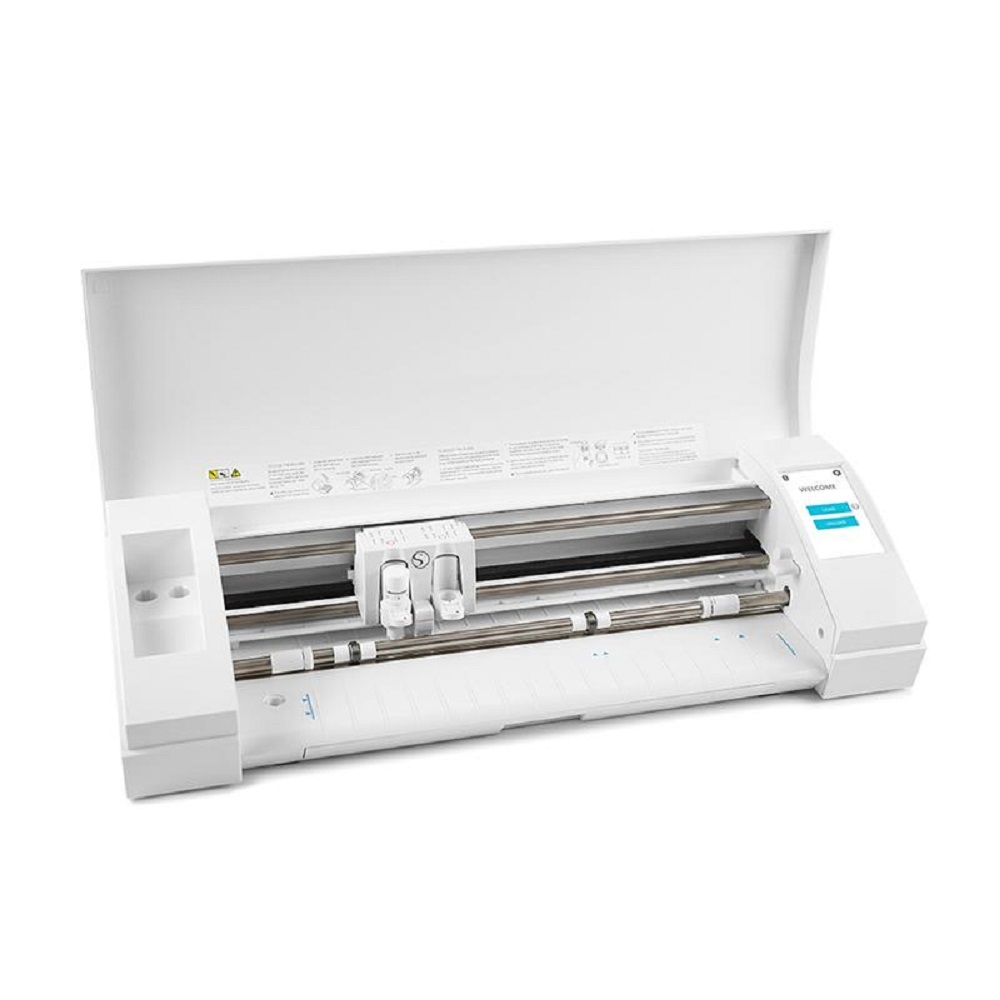

## Silhouette Cameo 3

This file contains notes on how to use the Silhouette Cameo 3 Craft Cutter.



### Getting Started with the Machine

In order to do anything with the Cameo, you first have to   
1. Load the material (with or without a cutting mat).
2. Adjust the blade depth.
3. Load the blade.

#### Loading the material

Below are helpful links for feeding your material to the machine in various ways.

1. [Load your material with a cutting mat.](https://www.youtube.com/watch?v=17fOYQWrdoo)
	* Since we are not using the Silhouette Studio software like they do in this video, set your material size by making your canvas in whatever program you're using to design equal to the width and height of the material in inches or mm.

2. [Load your material without a cutting mat.](https://silhouette-secrets.com/2018/04/28/cutting-without-a-mat-on-the-cameo-3/) 

3. [Adjust the roller bars.](https://www.youtube.com/watch?v=BaBgzUAT34M)

4. [Additional guide on the cutting mat and loading the material](http://blog.craft-e-corner.com/2016/11/the-silhouette-cameo-mat-all-you-need-to-know-and-more.html)

#### Setting the blade length.

The standard ratchet blade which you will be using has the ability to cut a variety of materials such as normal paper, cardstock, fabric and more. To accomodate each material, it has an adjustable blade length that goes between 1 to 10 with 10 being the longest blade length. As a general rule of thumb, the thicker your material, the longer your blade length should be. (Note that you will often see blade length also refered to as blade depth.)

1. **Choose the right depth of the blade.**

	Here is a helpful guide taken from [blog.craft.e-corner](http://blog.craft-e-corner.com/2016/08/silhouette-101-all-about-the-blades.html) on the appropriate blade settings for different types of materials. 

	

	* This image shoes the recommended speed and "thickness" as well. You will be asked to specify these setting later in the software for sending your designs to the Cameo. Speed dictates how fast the machine cuts. "Thickness" dictates how much force is exerted onto the blade while cutting. The name thickness doesn't really make sense so I'll be referring to it to force or pressure. If the machine is not cutting through your material, increase the force. If the machine is causing your material to tear, decrease the force.

2. [**Adjust the blade length.**](https://www.youtube.com/watch?v=q0jupRU44d4)


3. **Installing the blade.**
	
	
	* Image taken from [Silhouette School Blog](https://www.silhouetteschoolblog.com/2016/07/silhouette-cameo-3-release-getting-started.html)

	The above image shows the blade holder. To install the blade, pull the white tab on the blade holder out, put the blade into the blade slot (remember to push down fully), and push the tab back in to lock.

	Similarly, to remove the blade, unlock first by pulling the tab out.

	Here is a [helpful video](https://www.youtube.com/watch?v=q0jupRU44d4) that goes into more detail for troubleshooting blade installation problems.

### Making your design

Design our cut template in any *vector* software you feel comfortable with (i.e., Inkscape, Illustrator, etc.). The main requirement is that you must be able to export the designs as an SVG file.

When creating your design, make sure to:

0. **Make the height and width of your design the height and width of your physical paper canvas in inches or mm.** Do not specify width and height in terms of pixels!
1. **Avoid including raster images in your svg file.** The machine can't cut these anyways!   
2. **Convert all SVG objects to paths.** The open source software we will be using to cut require that all SVG objects (such as fonts and shapes) are expressed as paths in order to do the trajectory planning.
3. **Use an original design.** Your design must be original! This means do not take a template from the internet or take an existing image or vectorize it. If however, you want to *draw* your design by hand, you can take an image of the drawing and *vectorize* it in Inkscape or Illustrator.
	* Tips for drawing designs by hand:
		* Draw on white paper.
		* Make your final design dark. Take care to cleanly erase all unwanted lines.
		* Take a photo of the design by making your phone camera as parallel to the paper as possible. To avoid getting the camera shadow, in your image, I find that it's helpful to take the photo from farther away and use zoom to frame only the design in the photo.
		* [Use Inkscape to vectorize the image.](http://goinkscape.com/how-to-vectorize-in-inkscape/)

### Software for Sending the Design to the Machine

You have two options for what software you can use to send your design to the machine. If you want to design your own path planning algorithm and do usb programming to send those commands to the machine, you may do that too. Also feel free to modify the code for this software. If you do, please tell us what you did and why in your writeup.

1. [**Robocut**](http://robocut.org/)

	This is a simple program that takes in an SVG file, plans a cutting path, and sends that cutting path to the machine for cutting. Note that the website itself isn't very descriptive so I'll try to give you some more guidance here.

	** Installation **

	1. Go to the GitHub repo at [https://github.com/Timmmm/robocut](https://github.com/Timmmm/robocut).

	2. For Windows and Linux installations, follow the instructions in the repo.

	3. For OSX, you'll have to build from source. Here's how to do so:
		1. First, clone the repo and cd into it:   
		```git clone https://github.com/Timmmm/robocut.git && cd robocut```
		2. Pull submodules.
		```git submodule update --init --recursive```
		3. Create a build dir and cd into it.
		```mkdir build && cd build```
		4. Build the code.
		```cmake ..```
		```make```

	After you've completed these steps, you should have a Robocut executable which you can click on and launch. In OSX, it will be located in your build folder.

	**Importing and Cutting**

	1. Import your SVG. Go to File>>Open, and select your file.
	2. Send your SVG to the machine. Go to File>>Cut.
	3. When you do this, a dialog should pop up with cut settings for you to specify. 
		* First, choose your material from the dropdown.
		* Next, set your ```speed``` and ```thickness``` values. These should have autopopulated when you selected a material, but you can choose to modify them. 

2. [**Silhouette Inkscape**](https://github.com/fablabnbg/inkscape-silhouette)

	This is an Inkscape extension that enables you to send your designs straight from Inkscape. To use it, navigate to the [github repo](https://github.com/fablabnbg/inkscape-silhouette) and follow instructions for installation and use. It's fairly well documented.

#### Specific Writeup Instructions

For this assignment, we want you to dig into the code for these tools a bit. Tell us which tool you decided to use, how that tool does its path planning (i.e., what decisions it makes), and hypothesize about why it makes those decisions.

### Cleaning up

Please make sure that there is no residual paper on the cutting mat and please place the plastic film back over the cutting mat.

### Other Resources

* [GPGL Reference](doc/GPGL.pdf)

