<style>
#bom {
	display: inline-block;
	width: 25%;
	margin-right: 1%;
	vertical-align: top;
	word-wrap: break-word;

}

#build-img{
	width: 100%;

}

#mat-imgs {
	width: 73%;
	vertical-align: top;
	display: inline-block;
	
}

.mat-label {
	font-weight: bold;
	color: green;
}

.col-txt {
	width: 50%;
	word-wrap: break-word;
	display: inline-block;
	vertical-align: top;
	margin-right: 5%;
}

.note{
	color: #a9a9a9;
	font-style: italic;
	font-size: 12pt;
}

.col-img{
	display: inline-block;
	vertical-align: top;
	width: 30%;

	img{
		width: 100%;
		margin-bottom: 5px;
	}
}

.grid-img img{
	height: 200px;
	margin: 2px;
}

#mat-grid {
	width: 100%;
	display: inline-block;
}

#mat-grid.grid-img img{
		height: 120px;
		margin: 5px;
		padding: 2px;
	}


</style>

## Goals

This assignment is to build a working t-bot plotter.

1. Learn how to work with 2020 v-slot aluminum extrusion
2. Understand how to control bipolar stepper motors
3. Learn how to compile, install, and run GRBL
4. Plot a drawing

## T-Bot Kit

**Bill of Materials**

<div id="materials">
	<div id="bom">
		<ul>
			<li>2 x 500mm 2040 v-slot <span class="mat-label">(A)</span></li>
			<li>8 <a href="https://openbuildspartstore.com/solid-v-wheel-kit/">solid v-wheel kits</a>[w/ 2 precision spacers and 1 nylock nut] <span class="mat-label">(B)</span></li>
			<li>4 eccentric spacers <span class="mat-label">(C)</span></li>
			<li>6 spacers 1/4" <span class="mat-label">(D)</span></li>
			<li>2.133m 6mm wide GT2 belt <span class="mat-label">(E)</span> ** note that you need to cut your own belt! **</li>
			<li>2 GT2 smooth pulley <span class="mat-label">(F)</span></li>
			<li>2 GT2 timing pulleys, 20t <span class="mat-label">(G)</span></li>
			<li>1 arduino uno R3 <span class="mat-label">(H)</span></li>
			<li>1 stepper motor driver shield <span class="mat-label">(I)</span></li>
			<li>2 stepper motor driver <span class="mat-label">(J)</span></li>
			<li>2 NEMA-17 stepper motors <span class="mat-label">(K)</span></li>
			<li>1 IEC power cord <span class="mat-label">(L)</span></li>
			<li>1 Mean Well LRS-150-24 24V power supply <span class="mat-label">(M)</span></li>
			<li>2 thin M5 t-nuts <span class="mat-label">(N)</span></li>
			<li>2 M5 nylock nuts <span class="mat-label">(O)</span></li>
			<li>6 thick M5 t-nuts <span class="mat-label">(P)</span></li>
			<li>2 M5x5mm set screws <span class="mat-label">(Q)</span></li>
			<li>6 M5x10mm BHCS <span class="mat-label">(Q)</span></li>
			<li>8 M5x30mm BHCS <span class="mat-label">(R)</span></li>
			<li>2 M5x25mm BHCS <span class="mat-label">(R)</span></li>
			<li>8 M3x10mm BHCS <span class="mat-label">(S)</span></li>
			<li>2 Omron snap-action switches <span class="mat-label">(T)</span></li>
			<li>1 SG90 9g micro servo <span class="mat-label">(U)</span></li>
			<li>8 M5 precision shims <span class="mat-label">(V)</span></li>
			<li>1 laser cut center plate <span class="mat-label">(W)</span></li>
			<li>2 laser cut motor plates <span class="mat-label">(X)</span></li>
			<li>1 laser cut idler plate <span class="mat-label">(Y)</span></li>
		</ul>
	</div>
	<div id="mat-imgs">
		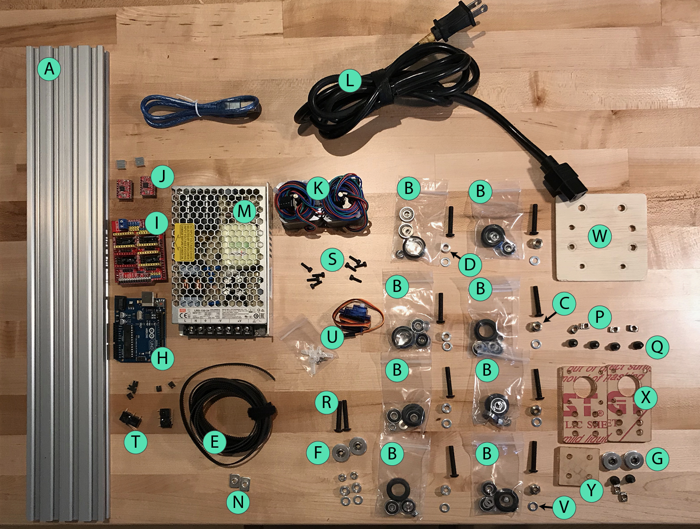
		<div id="mat-grid" class="grid-img">
			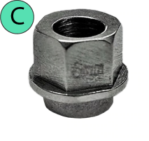
			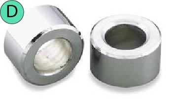
			
			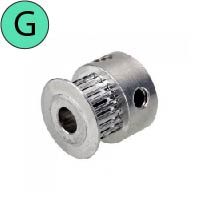
			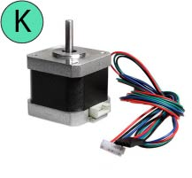
			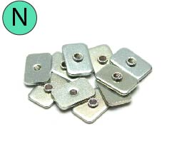
			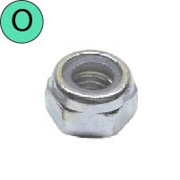
			
			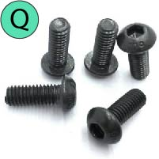
			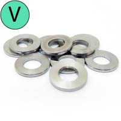
		</div>
	</div>
</div>

## Mechanical


### Assembling center plate

**Components**

- 1 custom laser cut plate
- 8 [solid v-wheel kits](https://openbuildspartstore.com/solid-v-wheel-kit/) (v-wheel, 2 bearings, 2 shims, nylon nut)
- 4 x 1/4" spacers
- 4 x 1/4" eccentric spacers
- 24 precision shims

**Instructions**

<span class="note"> ** Click on an image to view a larger version of it.</span>

<div id="center-plate" class="two-col">

<div class="col-txt">
	<ol>
		<li> Start by removing the protective paper from the acrylic plate. <br/><br/>
			<i>WARNING: (1) The edges of laser-cut acrylic can be sharp and may require scraping or sanding; (2) Removing paper protection from acrylic may be difficult.</i></li>
		<li> Assemble the 8 solid v-wheels. 
			This involves inserting 2 bearings into the wheel
			with a precision shim placed between the bearings. <a href="https://www.youtube.com/watch?v=YtkGiLg2edk">Solid v-wheel kit assembly video</a></li>
		<li> Attach 4 solid v-wheels to one slide of the center plate.
			Each v-wheel requires 1 M5x30mm cap screw,
			a v-wheel, a 1/4" spacer or eccentric spacer,
			2 precision shims, and a nylon nut.
			First, insert the 4 machine screws facing up,
			then place a spacer and 2 shims on each bolt.
			Next add the v-wheel, 
			and then place the nylon nut and hand tighten.
			The plate's large holes are for the eccentric spacers. <br/><br/>
			Note that as the eccentric spacer is rotated 
			the off-axis center hole causes the center of the
			spacer to move relative to the center of the plate.
			Orient the eccentric spacer so that the notch is facing outward;
			aligning it in this way creates the maximum distance 
			between the opposing wheels.</li>
		<li> Flip the plate over and attach 4 more solid wheels on the other side.</li>
		<li> Insert a piece of 2040 through the wheels on the top.
			Adjust the eccentric spacers to achieve smooth motion.
			The wheels should fit tightly against the 2040 so that there is no play,
			yet not so tight that you cannot rotate the wheels by hand.
			Repeat this process for the 2040 on the bottom.<br/><br/>
			<i>WARNING: The edges of the 2040 are sharp, and can damage the wheels when inserted into the assembly. Assemble the 2040 & wheel assembly once, then tighten the elliptical spacers last.</i></li>
	</ol>
</div>
<div class="col-img">
	<a href="images/center0.jpg" target="_blank"></a>
	<a href="images/center1.lg.jpg" target="_blank">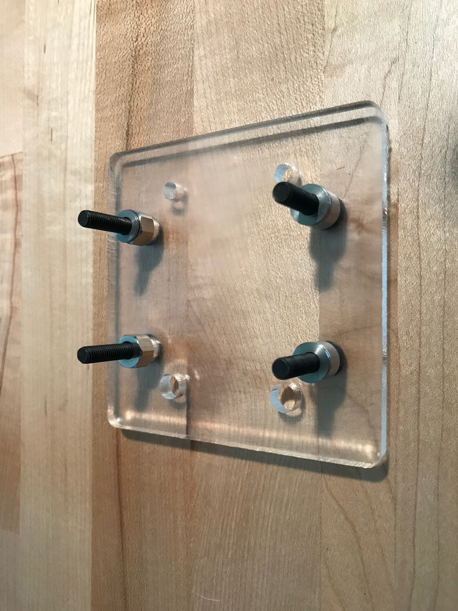</a>
	<a href="images/center2.lg.jpg" target="_blank">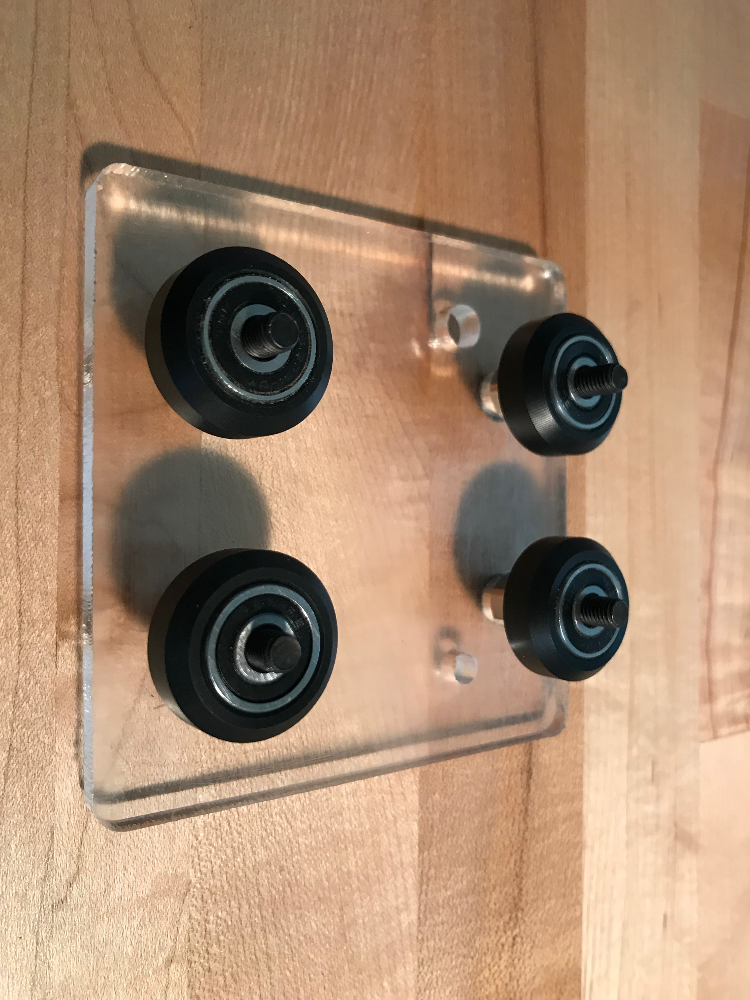</a>
	<a href="images/center3.lg.jpg" target="_blank">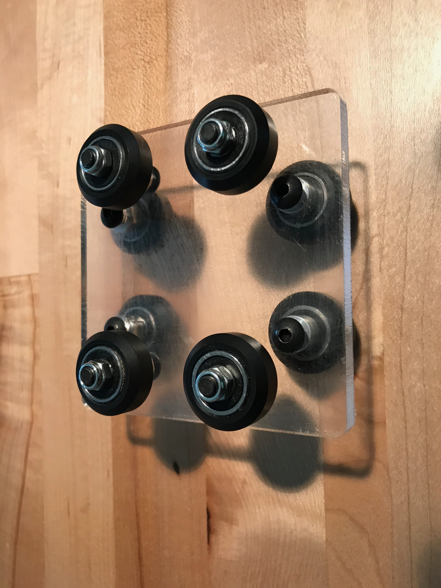</a>
	<a href="images/center4.lg.jpg" target="_blank">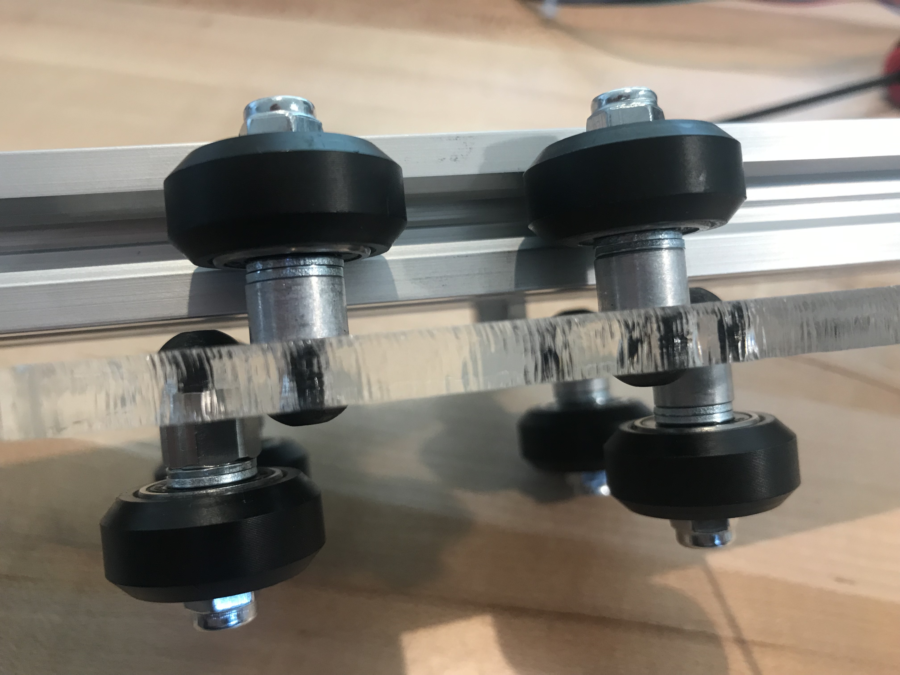</a>
</div>

</div>

### Stepper motor and mount

**Components**

- 2 custom laser plates for motors
- 2 NEMA17 stepper motors
- 8 M3 x 10mm BHCS 
- 4 M5 x 10mm BHCS 
- 4 M5 t-nuts
- 2 GT2 20t timing pulleys with set screws

**Instructions**

<span class="note"> ** Click on an image to view a larger version of it.</span>

<div id="stepper" class="two-col">

<div class="col-txt">
	<ol>
	<li>Attach the stepper motor to the motor mounting plate using 4 M3 BHCS.</li>
	<li>Slide 2 x M5 machine screws through the center holes of the mounting plate.
	Attach a t-nut to each screw.</li>
	<li>Attach the timing pulley to the shaft of the stepper motor.
	Note that the shaft has a flat side. 
	Align one of the set screws so that it pushes against the flat side and tighten both screws.</li>
	<li>Repeat this process for the second stepper motor.</li>
	</ol>
</div>

<div class="col-img">
	<a href="images/stepper0.jpg" target="_blank">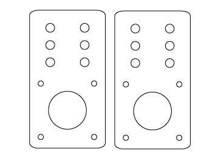</a>
	<a href="images/stepper1.jpg" target="_blank">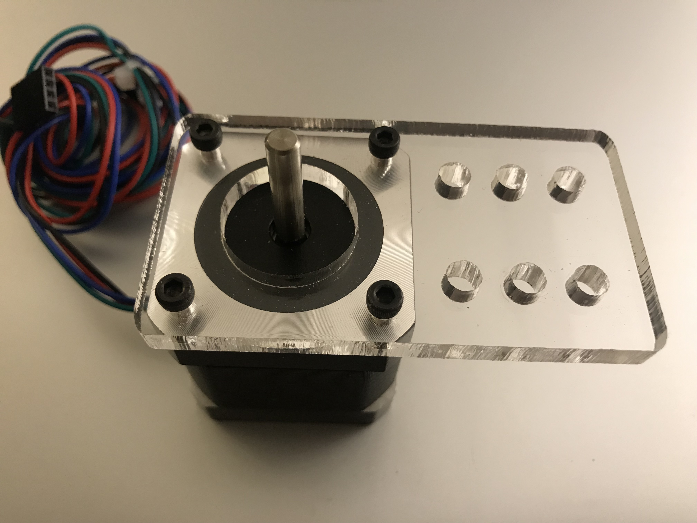</a>
	<a href="images/stepper2.jpg" target="_blank">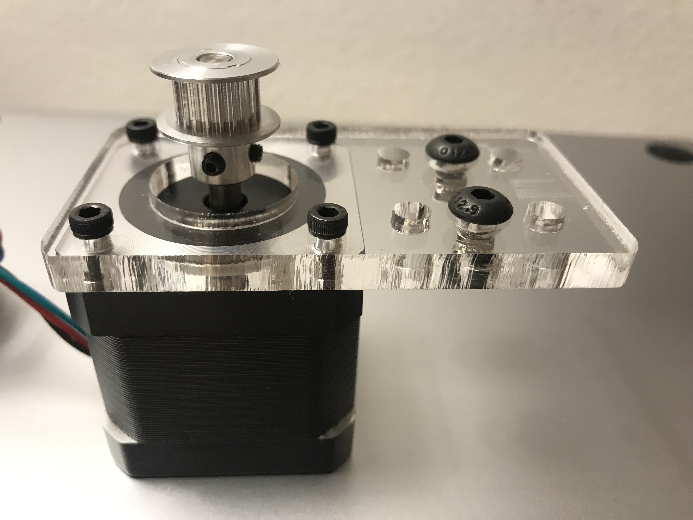</a>
	<a href="images/stepper3.jpg" target="_blank">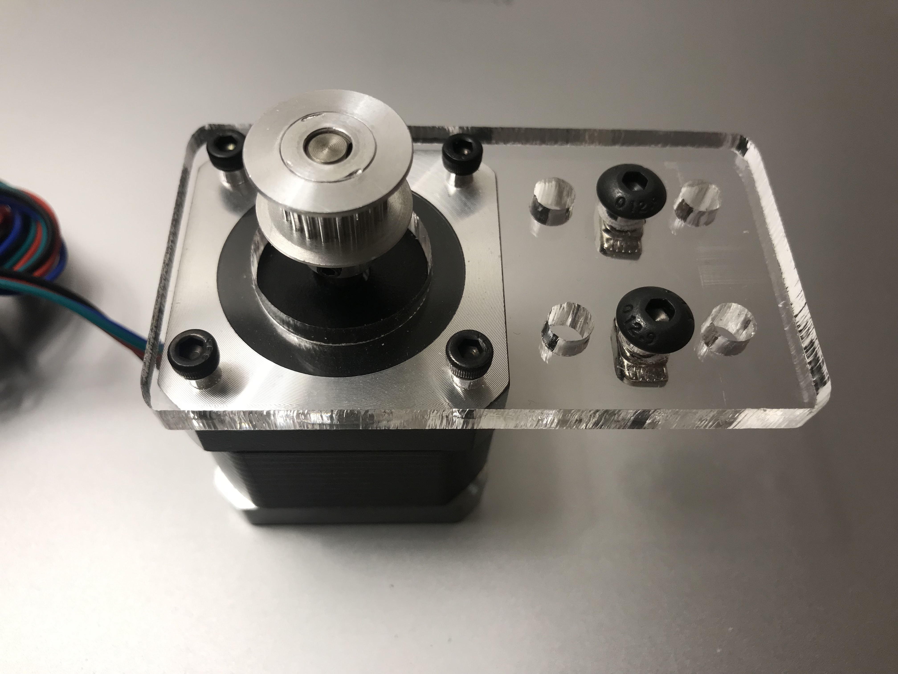</a>
</div>
</div>

### Idler pulleys and mount

**Components**

- 1 custom laser-cut acrylic plate for mounting 2 idler pulleys
- 2 smooth pulleys with bearings
- 2 x 1/4" spacers
- 2 M5 x 25mm BHCS + 2 M5 nuts
- 2 M5 x 10mm BHCS + 2 M5 t-nuts

**Instructions**

<span class="note"> ** Click on an image to view a larger version of it.</span>

<div id="idler">
	Attach smooth pulleys to the mounting plate.
	<ol>
		<li>Insert 25mm cap screw through one side,
			then on the other side add the spacer, the pulley,
			and then tighten with a nylock nut. Make sure not 
		        to overtighten the assembly, the pulleys should
		        still be able to rotate. It's okay if the assembly
		        is a little loose.</li>
		<li>Repeat for the 2nd pulley.</li>
		<li>Add 2 x 10mm machine screws and t-nuts.</li>
	</ol>
</div>

<div class="grid-img">
<a href="images/idler-drawing.jpg" target="_blank">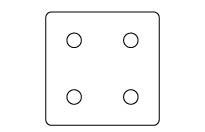</a>
<a href="images/idler.mount1.lg.jpg" target="_blank">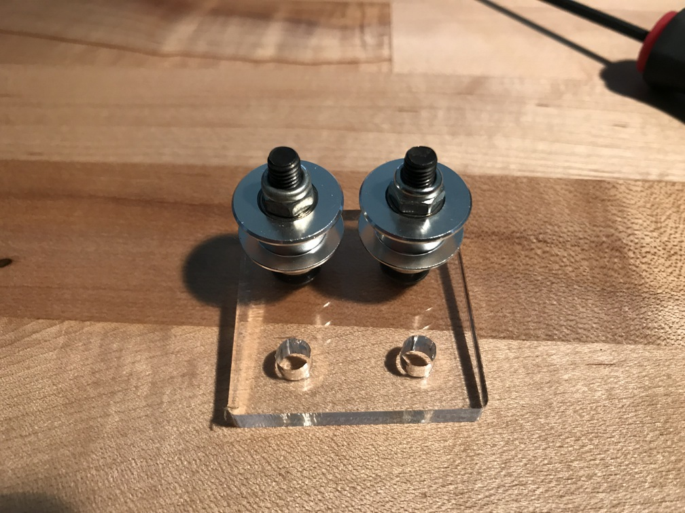</a>
<a href="images/idler.mount2.lg.jpg" target="_blank">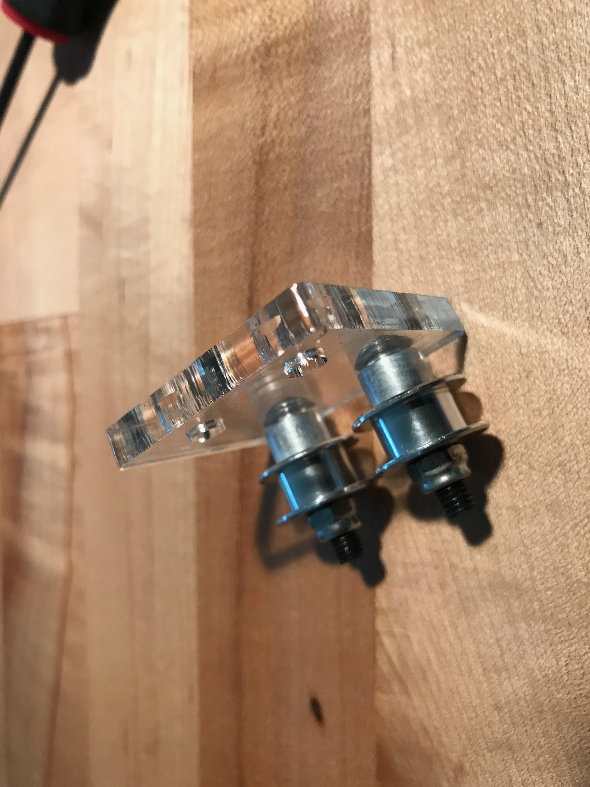</a>
<a href="images/idler.installed1.lg.jpg" target="_blank">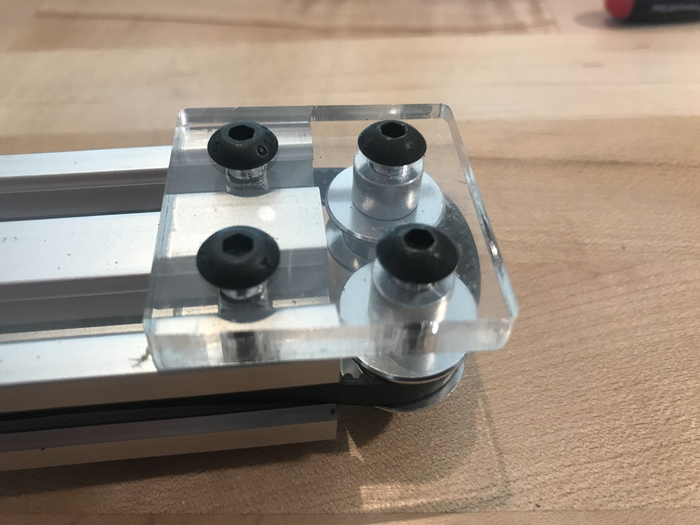</a>
<a href="images/idler.2040a.lg.jpg" target="_blank">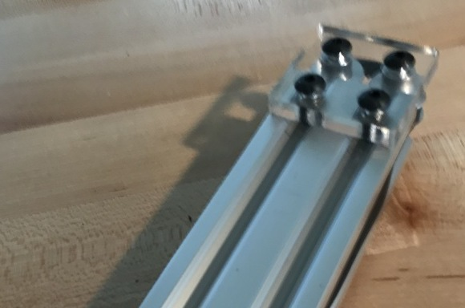</a>
<a href="images/idler.2040b.lg.jpg" target="_blank">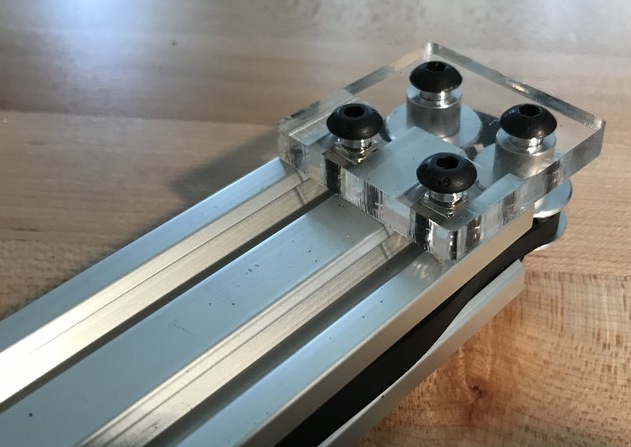</a>
<a href="images/idler.2040c.lg.jpg" target="_blank">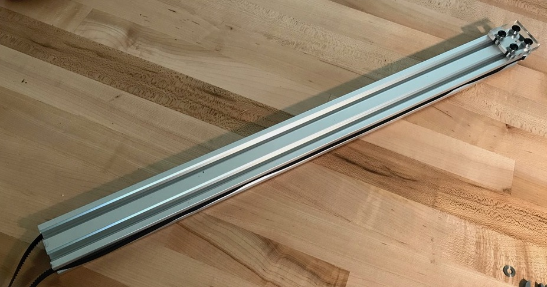</a>
</div>


### Assembling tbot

**Components**

- 2040 with idler pulleys
- 2040 with 2 stepper motor mounts
- Center plate assembly
- 2.133m GT2 timing belt
- 2 thin t-nuts
- 2 M5x5mm set screws

**Assembly**

<span class="note"> ** Click on an image to view a larger version of it.</span>

<div id="assembly" class="two-col">

<div class="col-txt">
	<ol>
		<li>Slide center plate onto 2040.</li>
		<li>Attach idler pulleys to one end of 2040.</li>
        <li>Cut timing belt to length. The final length should be 2.133 mm.</li>
		<li>Position timing belt.</li>
		<li>Attach stepper motor to one side of extrusion.</li>
		<li>Slide extrusion with belt through v-wheels on center plate.</li>
		<li>Loop timing belt through solid v-wheels.</li>
		<li>Loop timing belt over timing pulleys attached to stepper motors.</li>
		<li>Adjust timing-belt tension using the thin t-nuts. You may need to use a set screw to hold the belt in place.</li>
	</ol>
</div>
<div class="col-img">
	<a href="images/stepper.center1.lg.jpg" target="_blank">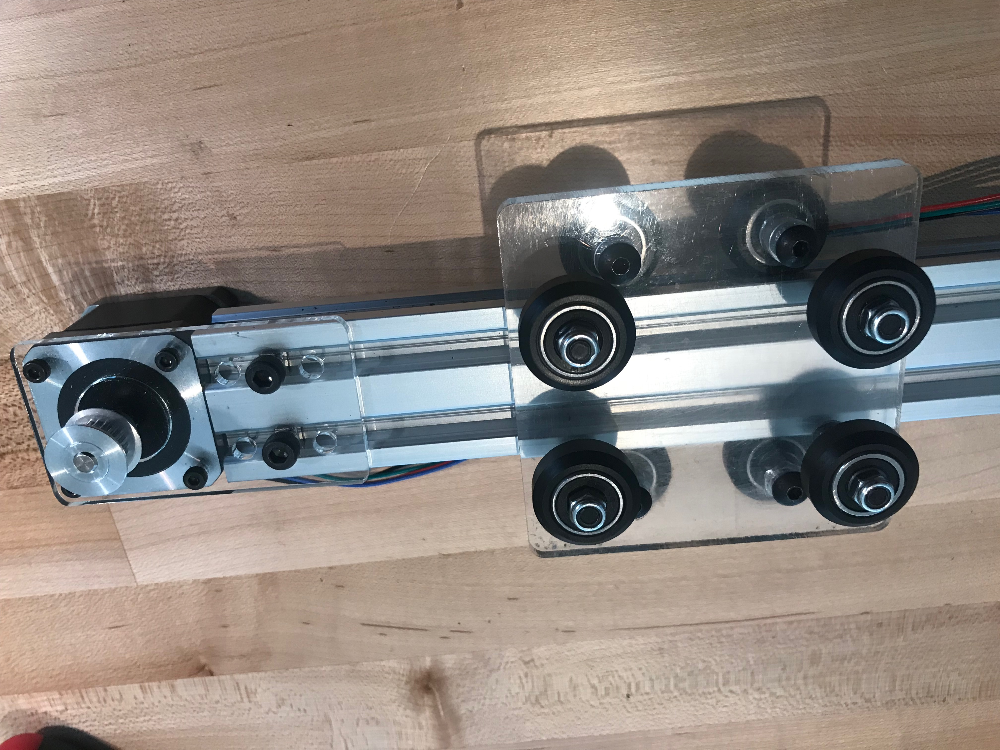</a>
	<a href="images/stepper.center2.lg.jpg" target="_blank">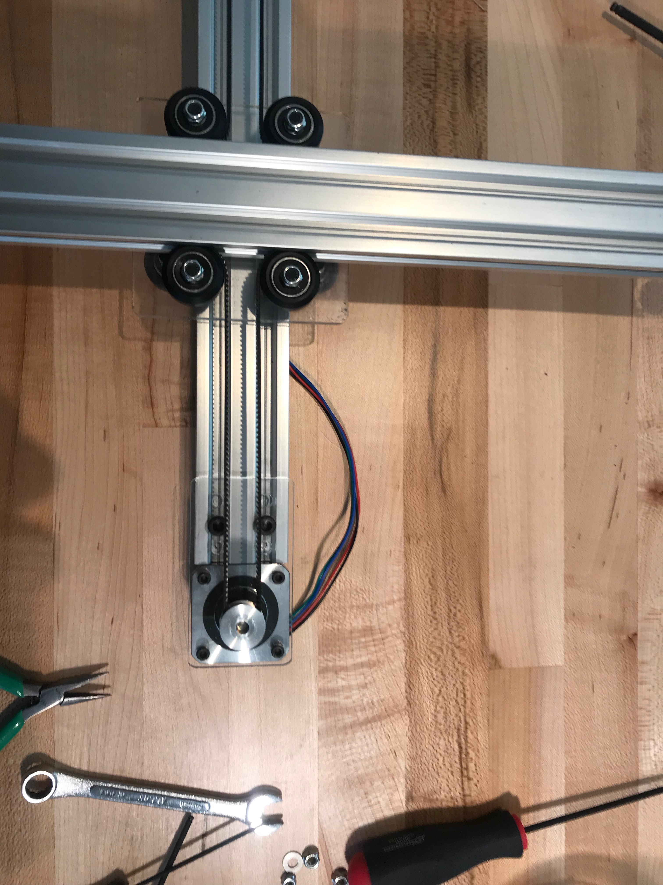</a>
	<a href="images/center.stepper.lg.jpg" target="_blank">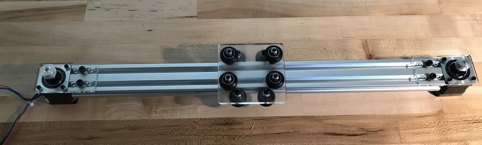</a>
	<a href="images/tbot1.lg.jpg">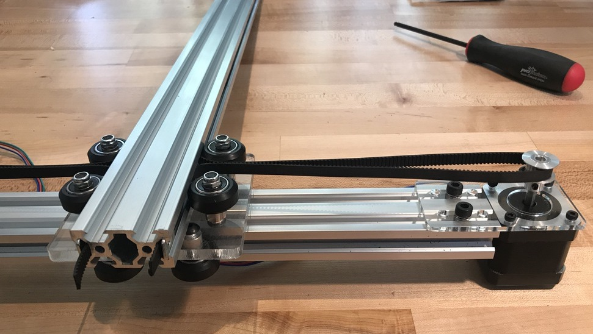</a>
</div></div>


## Electrical

### Power supply

**Components**

- IEC power cord with male plug removed
- Mean Well power supply

**Instructions**

<span class="note"> ** Click on an image to view a larger version of it.</span>

<div id="Electrical" class="two-col">

<div class="col-txt">
	<ol>
		<li>Slide switch on power supply to 115 VAC position (photo 2). </li>
        <li>Cut off the female end of the power cord. 
        The male (the one that plugs into the wall outlet should still be
        attached to the cord).</li>
        <li>Cut the outer sleeve on the power cord. You should remove
        approximately 1.5 in of the sleeve. After you do this,
        three wires should be exposed.</li>
        <li>Strip the three wires so that approximately 1/4" of copper
        wire is exposed.</li?
		<li>Attach line, neutral and ground to power supply terminals.
        Now is a good time to memorize the color scheme for electrical 
        wiring. Ground is green, neutral is white, and live is white.
        Take care to attach the right lines to the right terminals (photo 3).<br/><br/>
		<b>WARNING: Be Careful! These are live wires.</b></li>
	</ol>
</div>
<div class="col-img">
	<a href="images/power.supply.lg.jpg" target="_blank">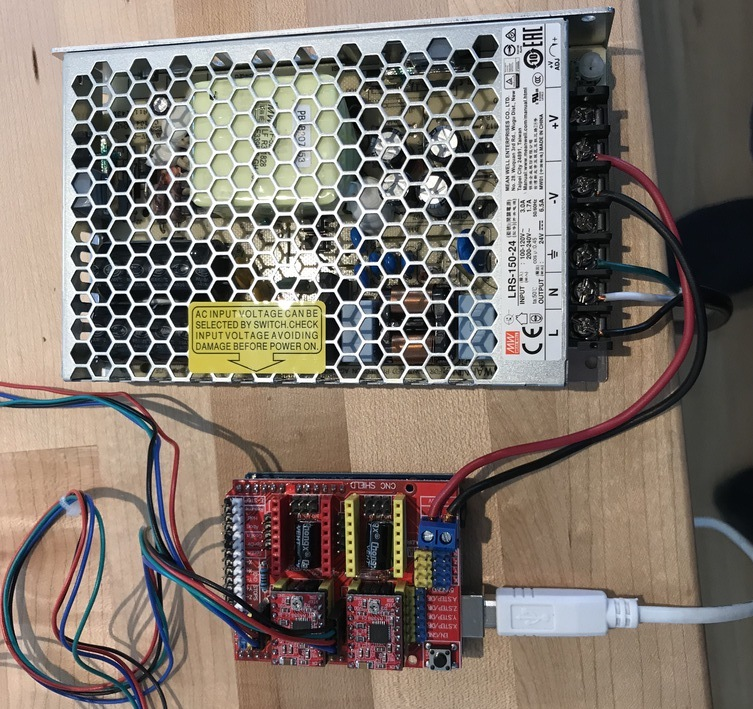</a>
	<a href="images/power2.jpg" target="_blank">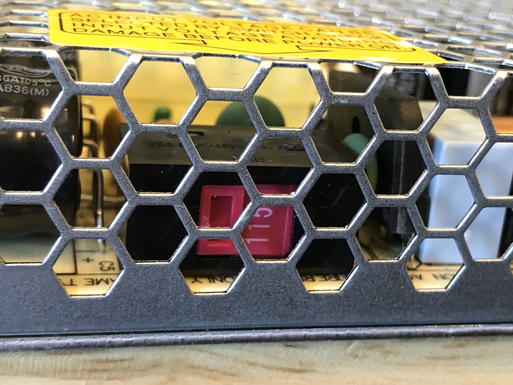</a>
	<a href="images/power1.jpg" target="_blank">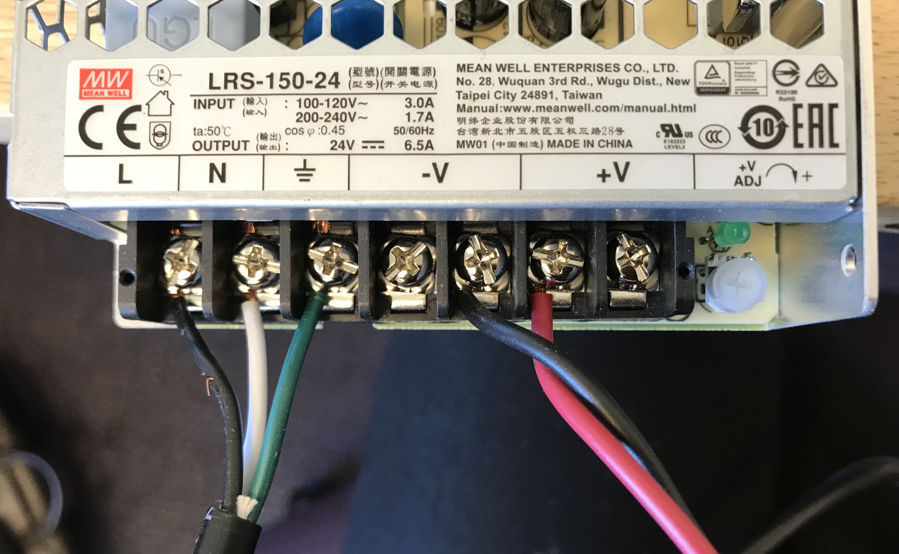</a>
</div>
</div>

### Stepper motor shield and stepper motor drivers

**Components**

- 1 Arduino UNO
- 1 stepper motor shield (CNC SHIELD)
- 2 A4988 stepper motor driver breakout boards
- 6 plastic jumpers

**Instructions**

<span class="note"> ** Click on an image to view a larger version of it.</span>

<div id="drivers" class="two-col">

<div class="col-txt">
The stepper motor shield has space for 
4 stepper motor driver chips.
The plotter only uses two of them,
one for X and one for Y.
	<ol>
		<li>The plastic jumpers are used to configure 
		the CNC SHIELD's stepper motor drivers for microstepping.
		Slide 3 jumpers over the headers M0, M1, and M2 (<a href="https://www.zyltech.com/product_images/uploaded_images/arduino-cnc-shield-micro-stepping-settings.jpg">see diagram</a>) to  configure the driver to 16 microsteps.
		Do this for both the X and the Y axes.</li>
		<li>Insert 2 stepper motor drivers (A4988) in X and Y axis sockets of the stepper motor shield.<br/><br/>
		<b>WARNING: Make sure that the stepper motor drivers are oriented correctly.</b></li>
		<li>Attach the stepper motor driver shield to the Arduino UNO</li>
		<li>Attach stepper motor cables to the 4 pin headers.</li>
		<li>Locate the red-black power zip cord.
        Cut a short length (8-12 in) and strip the wire ends
        exposing about 1/4" of copper wire.
        Attach 24V DC power supply to the stepper motor shield
        power terminals. Make sure you connect positive to positive,
        and negative to negative.
			The power supply provides power to the stepper motors.<br/><br/>
			<b>WARNING: DO NOT apply motor power to the shield unless
			the stepper motors as attached to the driver chips.
			Providing power when a motor is not attached 
			will short-circuit the driver chips.</b></li>
	</ol>
</div>
<div class="col-img">
	<a href="images/arduino.lg.jpg">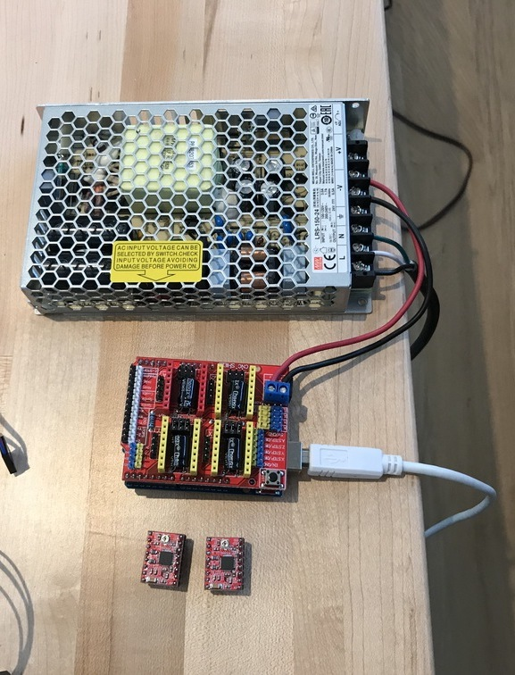</a>
</div>
</div>

## Software

**Instructions**

1. Download [Arduino development environment](https://www.arduino.cc/en/Main/Software)

2. Clone [GRBL 1.1](https://github.com/gnea/grbl).
The [wiki](https://github.com/gnea/grbl/wiki)
has instructions on [how to compile using the Arduino IDE](https://github.com/gnea/grbl/wiki/Compiling-Grbl) (recommended).

3. Follow the 
[instructions](https://github.com/grbl/grbl/issues/996)
to compile grbl in CoreXY mode.
This involves uncommenting the CoreXY definition in `config.h`
before compiling.

	```
	% make   # or use Arduino IDE
	```
4. Connect the Arduino UNO to your laptop and install.

	```
	% make install   # or use Arduino IDE
	```

5. Download [Universal GCODE Sender](<https://winder.github.io/ugs_website/>). Check your GRBL settings by entering "$$"

6. Configure GRBL settings by entering these values:
	
	`$100=80`  
	`$101=80`  
	`$110=2500`  
	`$111=2500`  
	`$120=200`  
	`$121=200`

7. Test by jogging, then try plotting a square.


## Pen holder and other attachments

TBD
