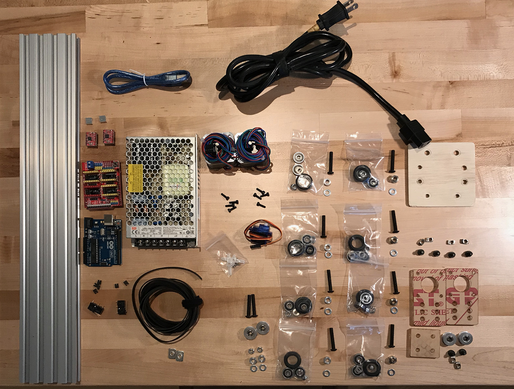

## Goals

This assignment is to build a working t-bot plotter.

1. Learn how to work with 2020 v-slot aluminum extrusion
2. Understand how to control bipolar stepper motors
3. Learn how to compile, install, and run GRBL
4. Plot a drawing

## T-Bot Kit

**Bill of Materials**

<div id="materials">
	<div id="bom">
		<ul>
			<li>2 x 500mm 2040 v-slot</li>
			<li>8 [solid v-wheel kits](https://openbuildspartstore.com/solid-v-wheel-kit/)</li>
			 (w/ 2 precision spacers and 1 nylock nut)
			<li>4 eccentric spacers</li>
			<li>6 spacers 1/4"</li>
			<li>2.133m 6mm wide GT2 belt</li>
			<li>2 GT2 smooth pulley</li>
			<li>2 GT2 timing pulleys, 20t</li>
			<li>1 arduino uno R3</li>
			<li>1 stepper motor driver shield	</li>
			<li>2 stepper motor driver</li>
			<li>2 NEMA-17 stepper motors</li>
			<li>1 IEC power cord</li>
			<li>1 Mean Well LRS-150-24 24V power supply</li>
			<li>2 thin M5 t-nuts</li>
			<li>2 M5 nylock nuts</li>
			<li>6 thick M5 t-nuts</li>
			<li>6 M5x8mm SHCS	</li>
			<li>10 M5x30mm BHCS</li>
			<li>4 M3x10mm SHCS </li>
			<li>2 Omron snap-action switches</li>
			<li>1 SG90 9g micro servo</li>
		</ul>
	</div>
	
</div>

## Mechanical


### Assembling center plate

**Components**

- 1 custom laser cut plate
- 8 [solid v-wheel kits](https://openbuildspartstore.com/solid-v-wheel-kit/) (v-wheel, 2 bearings, 2 shims, nylon nut)
- 4 x 1/4" spacers
- 4 x 1/4" eccentric spacers
- 24 precision shims

**Instructions**

<span class="note"> ** Click on an image to view a larger version of it.</span>

<div id="center-plate" class="two-col">

<div class="col-txt">
	<ol>
		<li> Start by removing the protective paper from the acrylic plate. <br/><br/>
			<i>WARNING: (1) The edges of laser-cut acrylic can be sharp and may require scraping or sanding; (2) Removing paper protection from acrylic may be difficult.</i></li>
		<li> Assemble the 8 solid v-wheels. 
			This involves inserting 2 bearings into the wheel
			with a precision shim placed between the bearings. <a href="https://www.youtube.com/watch?v=YtkGiLg2edk">Solid v-wheel kit assembly video</a></li>
		<li> Attach 4 solid v-wheels to one slide of the center plate.
			Each v-wheel requires 1 M5x30mm cap screw,
			a v-wheel, a 1/4" spacer or eccentric spacer,
			2 precision shims, and a nylon nut.
			First, insert the 4 machine screws facing up,
			then place a spacer and 2 shims on each bolt.
			Next add the v-wheel, 
			and then place the nylon nut and hand tighten.
			The plate's large holes are for the eccentric spacers. <br/><br/>
			Note that as the eccentric spacer is rotated 
			the off-axis center hole causes the center of the
			spacer to move relative to the center of the plate.
			Orient the eccentric spacer so that the notch is facing outward;
			aligning it in this way creates the maximum distance 
			between the opposing wheels.</li>
		<li> Flip the plate over and attach 4 more solid wheels on the other side.</li>
		<li> Insert a piece of 2040 through the wheels on the top.
			Adjust the eccentric spacers to achieve smooth motion.
			The wheels should fit tightly against the 2040 so that there is no play,
			yet not so tight that you cannot rotate the wheels by hand.
			Repeat this process for the 2040 on the bottom.<br/><br/>
			<i>WARNING: The edges of the 2040 are sharp, and can damage the wheels when inserted into the assembly. Assemble the 2040 & wheel assembly once, then tighten the elliptical spacers last.</i></li>
	</ol>
</div>
<div class="col-img">
	<a href="images/center0.jpg" target="_blank"></a>
	<a href="images/center1.lg.jpg" target="_blank"></a>
	<a href="images/center2.lg.jpg" target="_blank"></a>
	<a href="images/center3.lg.jpg" target="_blank"></a>
	<a href="images/center4.lg.jpg" target="_blank"></a>
</div>

</div>

### Stepper motor and mount

**Components**

- 2 custom laser plates for motors
- 2 NEMA17 stepper motors
- 8 M3 x 10mm SHCS 
- 4 M5 x 10mm SHCS 
- 4 M5 t-nuts
- 2 GT2 20t timing pulleys with set screws

**Instructions**

<span class="note"> ** Click on an image to view a larger version of it.</span>

<div id="center-plate" class="two-col">

<div class="col-txt">
	<ol>
	<li>Attach the stepper motor to the motor mounting plate using 4 M3 SHCS.</li>
	<li>Slide 2 x M5 machine screws through the center holes of the mounting plate.
	Attach a t-nut to each screw.</li>
	<li>Attach the timing pulley to the shaft of the stepper motor.
	Note that the shaft has a flat side. 
	Align one of the set screws so that it pushes against the flat side.</li>
	<li>Repeat this process for the second stepper motor.</li>
	</ol>
</div>

<div class="col-img">
	<a href="images/stepper0.jpg" target="_blank"></a>
	[image of plate with screws and t-nut but no pulley]<br>
	[image of finished stepper plate]
</div>
</div>

### Idler pulleys and mount

**Components**

- 1 custom laser-cut acrylic plate for mounting 2 idler pulleys
- 2 smooth pulleys with bearings
- 2 x 1/4" spacers
- 2 M5 x 30mm BHCS + 2 M5 nuts
- 2 M5 x 10mm SHCS + 2 M5 t-nuts

**Instructions**

<span class="note"> ** Click on an image to view a larger version of it.</span>

<div id="center-plate" class="two-col">

<div class="col-txt">
	Attach smooth pulleys to the mounting plate.
	<ol>
		<li>Insert 30mm cap screw through one side,
			then on the other side add the spacer, the pulley,
			and then tighten with a nut.</li>
		<li>Repeat for the 2nd pulley.</li>
		<li>Add 2 x 10mm machine screws and t-nuts.</li>
	</ol>
</div>

<div class="col-img">
<a href="images/idler-drawing.jpg" target="_blank"></a>
<a href="images/idler.mount1.lg.jpg" target="_blank"></a>
<a href="images/idler.mount2.lg.jpg" target="_blank"></a>
<a href="images/idler.installed1.lg.jpg" target="_blank"></a>
<a href="images/idler.2040a.lg.jpg" target="_blank"></a>
<a href="images/idler.2040b.lg.jpg" target="_blank"></a>
<a href="images/idler.2040c.lg.jpg" target="_blank"></a>
</div>
</div>


### Assembling tbot

**Components**

- 2040 with idler pulleys
- 2040 with 2 stepper motor mounts
- Center plate assembly
- 2.133m GT2 timing belt

**Assembly**

<span class="note"> ** Click on an image to view a larger version of it.</span>

<div id="center-plate" class="two-col">

<div class="col-txt">
	<ol>
		<li>Slide center plate onto 2040.</li>
		<li>Attach idler pulleys to one end of 2040.</li>
		<li>Position timing belt.</li>
		<li>Attach stepper motor to one side of extrusion.</li>
		<li>Slide extrusion with belt through v-wheels on center plate.</li>
		<li>Loop timing belt through solid v-wheels.</li>
		<li>Loop timing belt over timing pulleys attached to stepper motors.</li>
		<li>Adjust timing-belt tension using the thin t-nuts.</li>
	</ol>
</div>
<div class="col-img">
	<a href="images/stepper.center1.lg.jpg"></a>
	<a href="images/stepper.center2.lg.jpg"></a>
	<a href="images/center.stepper.lg.jpg"></a>
	<a href="images/tbot1.lg.jpg"></a>
</div></div>


## Electrical

### Power supply

**Components**

- IEC power cord with male plug removed
- Mean Well power supply

**Instructions**

<span class="note"> ** Click on an image to view a larger version of it.</span>

<div id="center-plate" class="two-col">

<div class="col-txt">
	<ol>
		<li>Slide switch on power supply to 115 VAC position.</li>
		<li>Attach line, neutral and ground to power supply terminals.<br/><br/>
		<b>WARNING: Be Careful! These are live wires.</b></li>
	</ol>
</div>
<div class="col-img">
	<a href="images/power.supply.lg.jpg"></a>
</div>
</div>

### Stepper motor shield and stepper motor drivers

**Components**

- 1 Arduino UNO
- 1 stepper motor shield (CNC SHIELD)
- 2 A4988 stepper motor driver breakout boards
- 6 plastic jumpers

**Instructions**

<span class="note"> ** Click on an image to view a larger version of it.</span>

<div id="center-plate" class="two-col">

<div class="col-txt">
The stepper motor shield has space for 
4 stepper motor driver chips.
The plotter only uses two of them,
one for X and one for Y.
	<ol>
		<li>The plastic jumpers are used to configure 
		the CNC SHIELD's stepper motor drivers for microstepping.
		Slide 3 jumpers over the headers M0, M1, and M2 (<a href="https://www.zyltech.com/product_images/uploaded_images/arduino-cnc-shield-micro-stepping-settings.jpg">see diagram</a>) to  configure the driver to 16 microsteps.
		Do this for both the X and the Y axes.</li>
		<li>Insert 2 stepper motor drivers (A4988) in X and Y axis sockets of the stepper motor shield.<br/><br/>
		<b>WARNING: Make sure that the stepper motor drivers are oriented correctly.</b></li>
		<li>Attach the stepper motor driver shield to the Arduino UNO</li>
		<li>Attach stepper motor cables to the 4 pin headers.</li>
		<li>Attach 24V DC power cables to the stepper motor shield.
			The power supply provides power to the stepper motors.<br/><br/>
			<b>WARNING: DO NOT apply motor power to the shield unless
			the stepper motors as attached to the driver chips.
			Providing power when a motor is not attached 
			will short-circuit the driver chips.</b></li>
	</ol>
</div>
<div class="col-img">
	<a href="images/arduino.lg.jpg"></a>
</div>
</div>

## Software

**Instructions**

1. Download Arduino development environment
<https://www.arduino.cc/en/Main/Software>

2. Clone [GRBL 1.1](https://github.com/gnea/grbl).
The [wiki](https://github.com/gnea/grbl/wiki)
has instructions on [how to compile using the Arduino IDE](https://github.com/gnea/grbl/wiki/Compiling-Grbl) (recommended).

3. Follow the 
[instructions](https://github.com/grbl/grbl/issues/996)
to compile grbl in CoreXY mode.
This involves uncommenting the CoreXY definition in `config.h`
before compiling.

	```
	% make   # or use Arduino IDE
	```
4. Connect the Arduino UNO to your laptop and install.

	```
	% make install   # or use Arduino IDE
	```

5. Download [Universal GCODE Sender](<https://winder.github.io/ugs_website/>). Check your GRBL settings by entering "$$"

6. Configure GRBL settings by entering these values:

	```
	$100=80 
	$101=80
	$110=2500
	$111=2500
	$120=200
	$121=200
	```

7. Test by jogging, then try plotting a square.


## Pen holder and other attachments

TBD